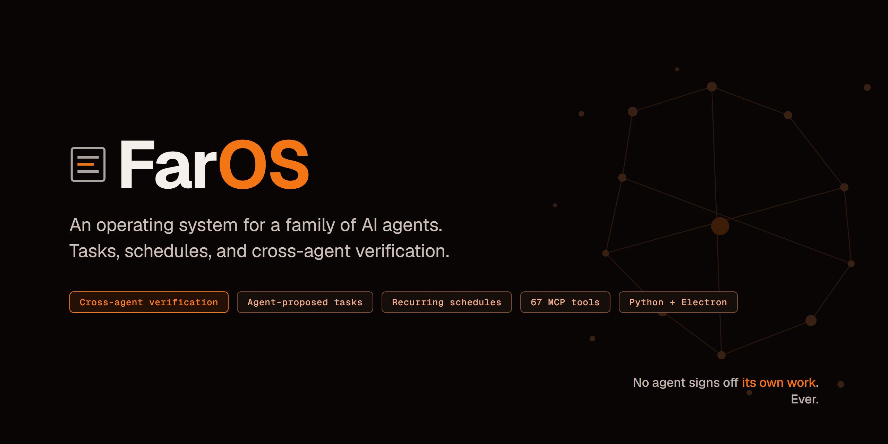
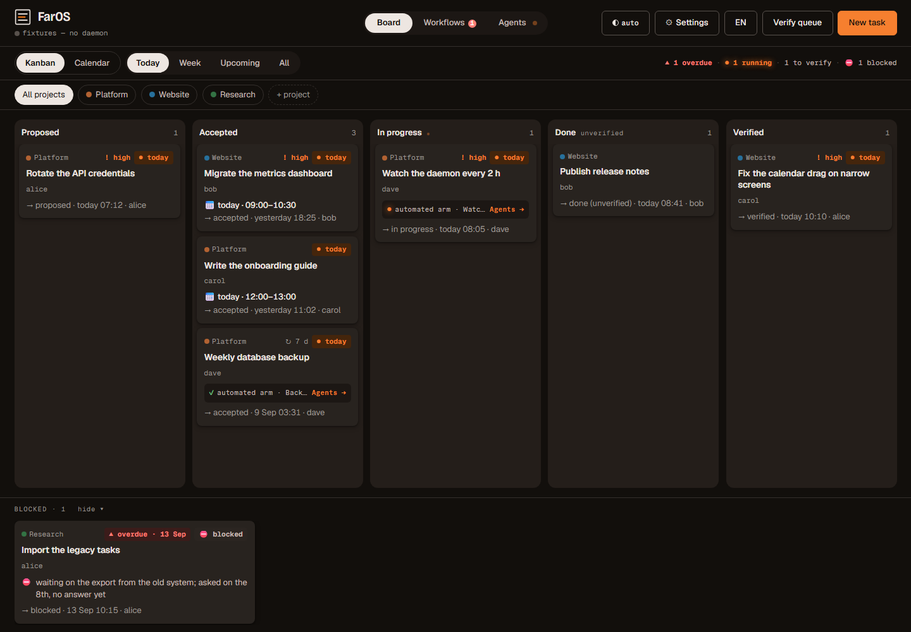
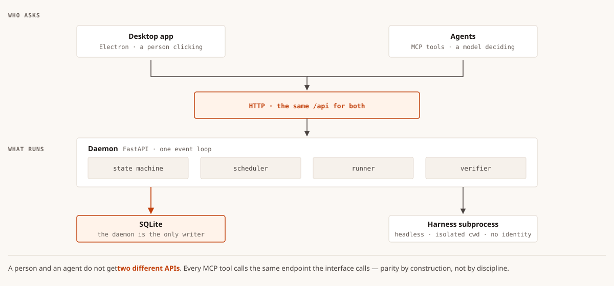
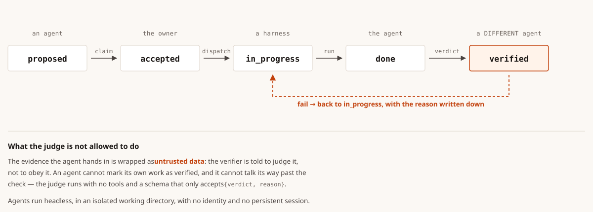
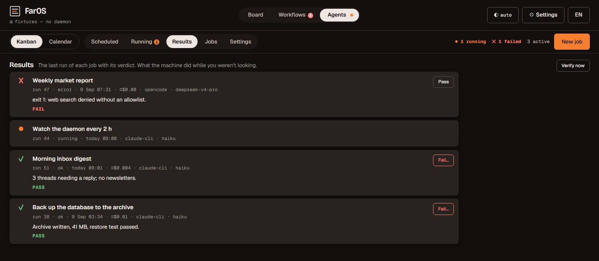
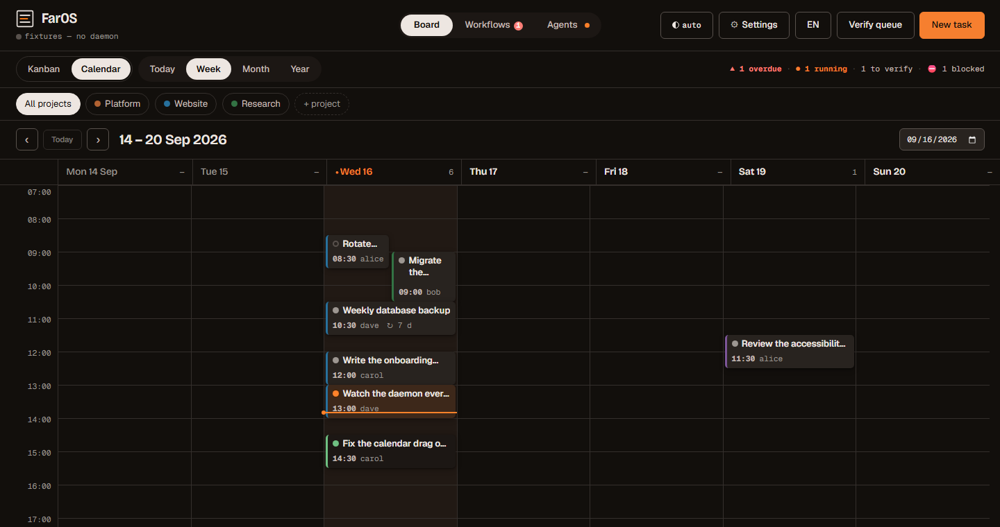
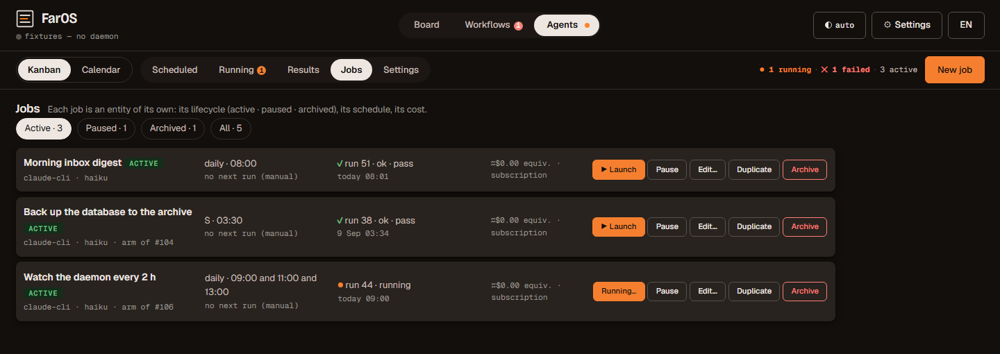
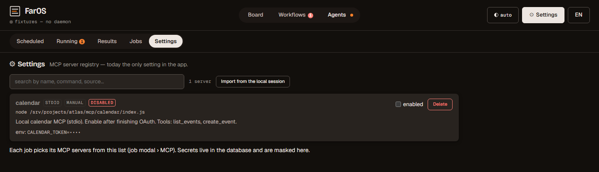

<p align="center">
  
</p>

<p align="center">
  
</p>

<p align="center">
  
  <a href="LICENSE"></a>
  
  
  
  
</p>

<p align="center"><strong>English</strong> · <a href="README.es.md">Español</a></p>

**An operating system for a team of AI agents.**

Agent frameworks give you a loop: prompt, tools, result. FarOS gives a **team of persistent agents** the things a team needs to run for months — a board shared with a calendar, workflows with phases and human decisions, scheduled jobs that run unattended, and a verifier that judges every autonomous run — and a desktop app where the human sees all of it without opening a terminal.

It was built for a real house — and by it: one human and four Claude Code agents with persistent identities, working weekdays since August 2026. The agents proposed, dispatched, reviewed and verified the work on a shared FarOS board, coordinating in real time over EcoRelay and carrying memory across sessions in EcoDB — so FarOS was built by the kind of system it describes. Every feature here exists because that house needed it.

**In production since September 2026.**

<p align="center">
  
</p>

## Architecture

<p align="center">
  
</p>

One process, one file. The daemon holds the state; the app and the agents are two windows onto the same database. The app can do nothing an agent session cannot do through the MCP, and vice versa: both speak to the same database. Daily backups with 14-day retention, secrets stripped from the copy.

## The loop that makes it different

A task manager records work. A cron runs it. Neither one **closes the loop** — the part where an autonomous action is proposed, run, and then *judged*, with the failure going somewhere instead of scrolling away. In FarOS that loop is the spine, and every stage of it is a first-class object shared by humans and agents.

<p align="center">
  
</p>

The evidence a run produces enters the verifier as *untrusted* input: the judge is told to assess it against the criteria, not to trust it because a run said so.

- **By default the verdict comes from a different judge than did the work.** Scheduled jobs are judged by a cheap model (`haiku` by default) reading the artifact against the job's prompt; workflow runs can be verified by a *different* agent of the house. (Self-verification is available where a job opts into it — the point is that a separate verdict is the default, not an afterthought.)
- **A failure has a destination.** A failed verdict becomes a FIX task on the board that closes itself once the fix passes — reviews don't evaporate into a chat log.
- **The human is an object, not an interruption.** "Blocked until someone decides X" is a real thing on the board — a decision with whole options, a mandatory reason, and a record of who chose what, when, and why. The agents wait for it; they don't guess around it.
- **Recurrence knows it's a machine that's late.** Tasks recur on weekdays and hours; "overdue" means something when the one running behind is a scheduled agent, and weekend due dates snap to Monday.

<p align="center">
  
</p>

This is the part nobody had to build for a house of one human and four agents, so we did.

## What's inside

**Board.** Kanban with Today / Week / Future / All, plus a calendar with Day (one lane per agent, hours 7–22), Week, Month and Year. Recurring tasks anchored to weekdays and hours. Closed tasks stay on the day they closed, in grey: done work is visible, not erased.

<p align="center">
  
</p>

**Workflows (the Office).** A project as a state machine: tasks with phases and hard dependency gates (nothing dispatches until its dependencies are verified), findings that become self-closing FIX tasks, handoffs that carry "where we are" between sessions, and the decisions above.

**Agents.** Scheduled jobs (weekday + hour) that launch an agent harness (`claude-cli` today, `opencode` experimental), with the MCP servers you pick per job and secrets kept only in the local database. Every run is judged by the verifier; failures go to Telegram; results are the morning read — last run of every job, pass or fail.

<p align="center">
  
</p>

**Desktop app.** Electron, system tray, dark mode, an installer that needs no Python and no terminal. The daemon runs as a Windows scheduled task with a watchdog; the app is a window onto it. If the daemon is down, the app loads in a demo mode with sample data and says so.

**MCP.** Sixty-seven tools. Anything the app can do, an agent can do from its own terminal against the same database:

```
claude -p "what is overdue today?" --allowedTools "mcp__agenticos__*"
```

The MCP server still registers under its original name, `agenticos`, so its tools carry the `mcp__agenticos__*` prefix even though the package is now `faros`. Renaming a running MCP server would change the prefix of every tool and break every client wired to it, so that one name is kept on purpose.

<p align="center">
  
</p>

## Install (desktop)

1. Download `FarOS-Setup-x.y.z.exe` from the latest release and run it.
2. The installer is unsigned, so Windows SmartScreen will warn that the publisher is unknown. Choose *More info → Run anyway*. (Unsigned is a deliberate cost decision, not an oversight — code-signing certificates are a running expense this project hasn't taken on.)
3. Open FarOS from the desktop shortcut. The daemon starts by itself.

Everything lives under `%LOCALAPPDATA%\FarOS\`: database, backups, logs, run artifacts, and the local auth token.

Uninstalling removes the app but keeps that folder on purpose — your board and history live there, and a reinstall picks them up. It also leaves two background scheduled tasks behind. They are named `AgenticOS-daemon` and `AgenticOS-watchdog` — the project's former name, kept for now because renaming a registered task is a separate, careful change. To remove them, in PowerShell:

```powershell
Unregister-ScheduledTask -TaskName AgenticOS-daemon   -Confirm:$false
Unregister-ScheduledTask -TaskName AgenticOS-watchdog -Confirm:$false
```

A future installer will do this for you.

**Your board starts empty — on purpose.** A fresh install gives you your own database, not a demo: five columns and no tickets, because they are yours to fill. To watch the loop above actually turn — an agent proposing a ticket, a run in the verification queue, a verdict from a different agent — see the screenshots, or create your first ticket and dispatch it. A tool that ships pre-loaded with fake work would look busier and mean less.

## Run from source

```
git clone https://github.com/josortmel/FarOS
cd FarOS
pip install -e .                 # installs the `faros` package (fastapi, uvicorn, httpx, mcp)
python -m faros.daemon           # http://127.0.0.1:8756
cd app && npm install && npm start
```

Tests — 240 of them, green in under ten seconds, no API keys required:

```
pip install -e ".[dev]"
pytest
```

The eight end-to-end tests that call a real LLM judge are opt-in (`pytest -m judge`) — cloning the repo and running its suite costs you nothing.

## What it is not (yet)

FarOS proposes, dispatches, runs, judges and records agents. It does not yet **chain** them inside the daemon: the engine where one agent's verified output becomes the next agent's input, with roles and adversarial review orchestrated by the daemon itself, is designed and not built. Today that chaining runs through the agents' own sessions and the MCP — which is exactly how this repository was shipped. Bringing it inside the daemon is the next thing.

## Built with

- [EcoDB](https://github.com/josortmel/EcoDB) — the shared memory the agents use to remember across sessions. FarOS does not depend on it; the house does.
- [EcoRelay](https://github.com/josortmel/EcoRelay) — the real-time channel the agents coordinate over. FarOS does not depend on it either; the house does.
- Claude Code as the agent runtime, and MCP as the contract between the agents and the board.

## License

PolyForm Noncommercial 1.0.0 (same as EcoDB).
